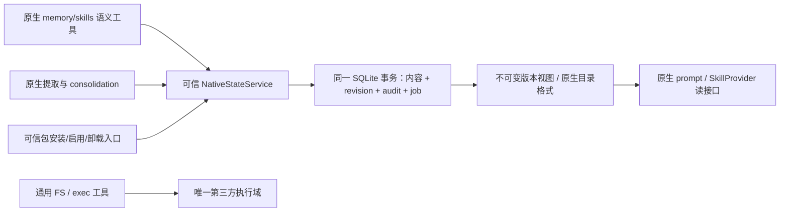

# 原生 memory/skills 审计接入

状态：源码研究与接入设计完成；原生 Rust 接入尚未实现。本文以 Codex 源码 `315195492c80fdade38e917c18f9584efd599304` 为基线，不声称它等价于已安装 0.153.4，也没有将源码推断冒充运行实测。RCA 已合并的原型在 `4351e77`，现有跨系统验收见 Fleet wiki `remote-adapter/codex-tool-prototype`。

本轮产出是源码接入设计及验收规范；未修改或编译 Codex Rust。仍沿用 Boss 的单一可信 harness + 不可信通用执行端约束。所有下列源码路径相对 `/Users/hoveychen/workspace/codex/codex-rs`。

## P1：memory 的真实写入链

| 入口 / 路径 | 已核查实现 | 接入含义 |
|---|---|---|
| `ext/memories/src/backend.rs:12` | `MemoriesBackend` 包含 add_ad_hoc_note/list/read/search，当前无 CAS、request_id | 可复用工具接口；并非全部 memory 存储接口 |
| `ext/memories/src/extension.rs:112` | tools 直接实例化 `LocalMemoriesBackend` | 需要后端 factory/枚举选择，不能只在 RCA 注入同名 MCP |
| `ext/memories/src/local/ad_hoc_note.rs:28` | `create_new` 创建笔记，随后 `write_all`，未统一版本/审计 | create-only 语义、原生时间戳 `.md` 文件名必须保留 |
| `ext/memories/src/prompts.rs:32` | summary 通过 `tokio::fs::read_to_string` 读取 | 替换 tools backend 后，prompt 仍会走旧磁盘副本；必须同时修改 |
| `memories/write/src/phase1.rs:383` | 提取结果交给 `state_db.memories().mark_stage1_job_succeeded` | 与 extension backend 无关的第二个写入入口 |
| `state/src/runtime/memories.rs:827` | 同一个 SQLite tx 更新 jobs、upsert stage1_outputs、排队 phase2 | 可在原有事务内追加语义审计；不要改成 SQLite 提交后再独立写 JSONL |
| `state/src/runtime/memories.rs:47` / `:55` / `:380` | 清空、引用 usage 更新、retention prune 都会修改 memory 状态 | 审计不能只覆盖新建笔记与 extraction 成功 |
| `memories/write/src/storage.rs:13` / `:25` | raw_memories.md 与 rollout_summaries 由 DB 结果派生；会覆写和删除文件 | 文件应标明 projection 身份、来源 revision、内容 hash |
| `memories/write/src/phase2.rs:316` | consolidation cwd 设为可信 memory root，关闭其 memory 自引用，并清空 MCP | 仅把可信 MCP 加到普通线程不覆盖 consolidation |
| `memories/write/src/runtime.rs:320` | consolidation 使用 default_environment_selections 选择执行域 | 保留原型的 remote-only registry 时不能假定可信 root 可通过通用工具访问；本条是源码推断，未实跑开启后的 consolidation |
| `memories/write/src/phase2.rs:410` / `:452` / `:457` | 先检查文件，再 reset Git baseline，再写 SQLite job succeeded | Git 文件状态、数据库 job 和语义审计没有现成单事务边界 |
| `memories/write/src/workspace.rs:13` / `:32` / `:81` | 准备目录、Git baseline、生成/删除 diff 文件 | scratch / projection 的维护事件需与用户语义内容区分 |
| `memories/write/src/start.rs:53` 与 `memories/write/src/extensions/ad_hoc.rs:8` | 创建 root、seed instructions；之后 prune 再跑 phase1/phase2 | 初始化也是实际写入，关闭生成模型调用不代表没有文件维护 |
| `memories/write/src/extensions/prune.rs:78` | 删除到期 extension resources | 删除必须与版本/审计一致，不可只在 install 时记日志 |
| `state/src/runtime.rs:241` | StateRuntime 打开 memories SQLite | DB 建库/WAL/迁移是存储引擎维护，不是模型获准的任意 FS 能力 |

复核命令：

```sh
cd /Users/hoveychen/workspace/codex
rg -n 'LocalMemoriesBackend::from_codex_home|build_memory_tool_developer_instructions' codex-rs/ext/memories/src
rg -n 'create_new|write_all' codex-rs/ext/memories/src/local/ad_hoc_note.rs
rg -n 'mark_stage1_job_succeeded|tx.commit|enqueue_global_consolidation_with_executor' codex-rs/state/src/runtime/memories.rs
rg -n 'mcp_servers =|agent_config.cwd|reset_memory_workspace_baseline|job::succeed' codex-rs/memories/write/src/phase2.rs
rg -n 'default_environment_selections' codex-rs/memories/write/src/runtime.rs
```

预期分别定位硬编码后端、即时笔记写入、原生 SQLite 事务、阶段二的 MCP 清空/文件提交及执行域选择。上述命令已在该基线运行并人工核对函数体。

结论：工具后端、prompt summary 读路径、后台生成与 pruning 必须同时纳入接入范围。不能因为 `MemoriesBackend` 已存在就声称全部原生 memory 只改一个接口即可接入。

## P2：skills 是版本包与配置，不只是一个 SKILL.md

| 入口 / 路径 | 已核查实现 | 接入含义 |
|---|---|---|
| `ext/skills/src/provider.rs:59` | SkillProvider 只有 list/read/search，要求 authority 保持一致 | 这是读接口；没有 install/update/delete 事务 |
| `ext/skills/src/provider/host.rs:47` | host read 必须命中已加载的 skill；随后交给 HostSkillsSnapshot | 不应把宿主路径当成任意文件接口开放 |
| `core-skills/src/model.rs:152` | snapshot 固定 metadata，但 read_skill_text 仍从映射 FS 或 LOCAL_FS 读正文 | 不能把该 snapshot 误认作内容版本快照；读取需要绑定 package revision/hash |
| `core-skills/src/service.rs:81` / `:100` | 构造服务时安装 bundled skills；关闭 bundled 时调用 uninstall | 仅关 feature 也可能产生删除维护写入 |
| `skills/src/lib.rs:32` / `:48` / `:121` | marker fingerprint 不匹配时删整个 `.system` 后重写嵌入资源 | 当前 marker 用 DefaultHasher，是缓存指纹，不能直接当作加密内容校验 |
| `core-skills/src/system.rs:6` | bundled uninstall 直接 remove_dir_all，忽略错误 | 审计模式应记录版本停用，清理失败不能伪称物理删除完成 |
| `skills/src/assets/samples/skill-installer/scripts/install-skill-from-github.py:172` | Python 直接 copytree 到 `CODEX_HOME/skills` | 在 remote-only 下这是执行端写入，不会自动安装到可信 host；需新的语义 package import |
| `app-server/src/request_processors/catalog_processor.rs:667` | skills/config/write → ConfigEditsBuilder → clear skills/plugin cache | enabled 配置也是持久状态，应与 skill revision / audit 对齐 |
| `core/src/config/edit.rs:453` | 按 name/path 修改 skills 配置 TOML | 启用状态不能遗漏；外部手改配置需显式导入或标为未审计外部修改 |
| `core-plugins/src/store.rs:288` / `:327` | 按版本 install/uninstall plugin；插件可以带 skills | PluginStore 是另一条持久化入口，不能仅拦单独 skill 安装器 |
| `core-plugins/src/manager.rs:1463` / `:1513` | 先 store.install，再 set_user_plugin_enabled | package 激活与配置分属不同提交；接入时必须处理失败恢复 |
| `core-plugins/src/manager.rs:1566` | 先 store.uninstall，再 clear_user_plugin | 删除同样有跨存储状态，需要 tombstone/恢复语义 |
| `core-plugins/src/remote_bundle.rs:484` | 暂存解包目录 rename 成正式目录 | 原生已存在 staging，可复用校验与原子目录发布，不能据此宣称和审计已原子 |

复核命令：

```sh
cd /Users/hoveychen/workspace/codex
rg -n 'install_system_skills|uninstall_system_skills' codex-rs/core-skills/src
rg -n 'remove_dir_all|fs::write|DefaultHasher' codex-rs/skills/src/lib.rs
rg -n 'read_skill_text|LOCAL_FS' codex-rs/core-skills/src/model.rs
rg -n 'skills_config_write_response_inner|ConfigEditsBuilder|clear_cache' codex-rs/app-server/src/request_processors/catalog_processor.rs
rg -n 'install_resolved_plugin|set_user_plugin_enabled|uninstall_plugin_id|clear_user_plugin' codex-rs/core-plugins/src/manager.rs
```

结论：需要保留 `Host / Executor / Orchestrator` 读域，并新增可信 package 生命周期服务；不能让模型把 executor authority 的路径升格为 host，也不能把现有 `skills_put(id, content)` 当成完整的原生技能包安装。

## P3：原生接入设计与最终选择

### 最终选择：Go 服务统一存储

Boss 在 2026-09-06 验收卡明确选择 **Go 服务统一存储**，并授权合并本轮研究文档。下文原生 SQLite 方案保留为已比较但未采用的备选；后续实现以本节为准。

Go 可信服务是 native memory/skills 内容、revision、审计及相关提交结果的唯一事实来源。Rust 原生 tools、prompt summary、stage1/phase2 和 skills 生命周期通过受限语义客户端访问它。SQLite 中需要保留的历史/其他 harness 状态不受此项迁移影响；涉及 memory 成功/水位的 job 状态必须移入同一服务事务，或明确作为可重放派生状态，不能跨 SQLite+JSONL 分别提交后宣称原子。

先扩展当前 Go 原型的结构化 native resources、package manifest、批量 CAS 与幂等事务；随后接原生 read/note，再接后台 jobs/consolidation 和 skills lifecycle。每个尚未适配的原生写入口在对应模式下 fail closed，不能回落旧本地存储。

### 已比较但未采用：可信 Rust 状态层提交

备选方案可复用原生 memory SQLite 的事务边界，在同一数据库事务中保存语义对象、版本、审计和对应 job 状态。对外维持 memory/skills 语义工具；现有 Go JSONL 服务保留为已经验收的独立原型，不让 native SQLite 与 Go JSONL 同时成为同一对象的事实来源。

原因是 `mark_stage1_job_succeeded` 已经把 job、提取内容和后续排队放进同一 tx。若在方法返回后调用外部 Go MCP 追加日志，将重新引入“状态已提交、审计没提交”的窗口；改成先日志后 DB 也会出现反向窗口。仅增加写前/写后 hook 不满足已建立的原子性要求。

可在现有 memories 数据库内新增 native resource/package/audit 表，历史文件名无需先重命名；这比引入跨 SQLite 数据库事务更小。skills 的文件正文与资源 manifest 可复用这层。磁盘目录只是带版本的派生视图，不能成为未经过审计的第二套可写事实来源。具体源码补丁应拆成小片、每片有集成验证；本文不是声称已完成的 Rust 实现。



### 操作身份与提交规则

每次变更由可信调用层附加 `actor_kind`（model_tool、memory_extract、memory_consolidate、bundled_install、user_config、retention、migration）、`thread_id`、`call_id` 或 job ownership token。模型参数不能伪造这些字段。

事务必须执行以下固定顺序：

1. 验证可信 domain 与逻辑 key、包内相对路径、大小和语义格式；拒绝绝对路径、`..`、软/硬链接逃逸以及未知 actor 权限。
2. 在 tx 中按 request_id 找历史结果。相同操作返回首次 receipt；参数 fingerprint 不同则拒绝。
3. 校验 expected_revision；若是后台 job，再验证 ownership token 与输入版本。冲突作为拒绝结果写审计，不能替换新版本。
4. 写入新资源/包 manifest 或 tombstone；写入相同 tx 的 audit 记录。phase1 的 job success 与 phase2 的已选输入/水位在同一 tx 更新。
5. commit 成功才返回 receipt；失败不能报告成功。导出审计 JSONL 仅是可重放的副本，不参与提交判定。
6. 异步/同步生成文件视图时记录 applied_revision。发布失败不能让原生读接口回退到旧的可变目录；读 canonical 状态或报告视图不可用。

不要求记录每一页 WAL 或每次 mkdir 的字节级 syscall；记录的是每个语义变更及其结果。建库/迁移、bundle materialization 和垃圾回收另记维护事件，避免把“审计语义状态”误写成“审计全部 OS I/O”。

### 原生格式与 API 契约

下面是**拟议的线协议契约示例**，用于确定审计边界；不是已经暴露的工具，不应对当前 RCA 直接调用。

即时笔记保持原生 add_ad_hoc_note 的 create-only 语义。可信适配层生成稳定 request_id，并把原生 filename 映射为域内 resource key；重复同一次调用可幂等，但新的调用试图创建同名不同内容仍返回 AlreadyExists。现有 response `{}` 可以暂时兼容，receipt 由可信层保留；不得用改模型提示词代替存储校验。

```json
{
  "operation": "memory.note.create",
  "request_id": "thread-call-derived-id",
  "expected_revision": 0,
  "filename": "2026-09-06T15-00-00-project-note.md",
  "content": "项目采用原生远端执行。"
}
```

consolidation 使用受限的语义 transaction，替代对可信 memory root 的通用文件写入。沿用原生内部 consolidation 流程，单一可信 harness 保留历史和状态；不增加 planner/worker 分域。`agent::get_config` 目前清空 MCP，故应注入**仅该内部流程可用的 native tool contributor**，并关闭它的通用 shell/apply_patch 工具。普通会话的通用工具仍全部 remote。

```json
{
  "operation": "memory.consolidation.commit",
  "request_id": "phase2-job-derived-id",
  "transaction_id": "server-issued-transaction",
  "expected_revision": 41,
  "artifacts": [
    {"kind": "memory", "content": "# Memory\n\n已确认的项目事实。\n"},
    {"kind": "summary", "content": "项目事实摘要。\n"}
  ]
}
```

transaction_id 由可信 service 绑定 job lease、选中 stage1 outputs 的版本向量、受限 artifact manifest。模型不能提交任意宿主路径。并发笔记追加、retention、lease 过期或输入变化都必须在提交时重新验证；旧 consolidation 不能覆盖后来变更。原生 `MEMORY.md`、`memory_summary.md`、rollout_summaries 与 extension resources 通过确定的 manifest 映射保留目录格式。raw_memories/diff/Git baseline 被明确标为派生输入和维护数据；Git 不能替代事务事实来源。

skill 采用 package import/replace/disable/delete，不是单字符串覆盖。语义资源 key 与显示路径分离，manifest 绑定 authority、package_id、revision、每文件 SHA-256、相对路径和类型。native `SkillProvider` 的 list/read 与 prompt 注入共用同一 manifest revision；查不到指定版本必须失败，不回退到 ambient host path。

```json
{
  "operation": "skills.package.replace",
  "request_id": "thread-call-derived-package-id",
  "package_id": "project-style",
  "expected_revision": 3,
  "files": [
    {
      "path": "SKILL.md",
      "media_type": "text/markdown",
      "content": "---\nname: project-style\ndescription: Apply this project's coding conventions.\n---\nUse the documented project conventions.\n"
    },
    {"path": "references/conventions.md", "media_type": "text/markdown", "content": "Use the repository's existing formatter.\n"}
  ]
}
```

导入时整个包完成语法与路径验证后才成为 active revision；脚本、图像和其他二进制资源须用有大小上限的 blob API，而不是强行塞进 UTF-8 Markdown。模型不能通过 package 导入顺便启用插件里的 MCP/hooks；那些能力必须保留独立授权和配置入口。

本次**实测源码 bundled 包大小**（逐文件 stat 求和，不是估算）：imagegen 12 文件/134942 B，openai-docs 12/102056 B，plugin-creator 10/65862 B，review-agent 2/2913 B，skill-creator 9/63340 B，skill-installer 8/30677 B。当前最大单文件 34271 B。这个样本没有超过现有 256 KiB 内容上限，但包含图片和多文件依赖，已经足以说明单字符串 API 的语义不兼容；不能由该样本推断用户所有技能包都足够小。

### 应改动的组件及责任

| 组件 | 具体改造责任 | 完成判据 |
|---|---|---|
| `state/src/runtime/memories.rs` 与新的相邻 native state 模块/迁移 | 事务内 audit 与 revision；复用 phase1 job tx；清空、usage、prune 和失败结果全覆盖 | 注入 audit insert 失败时旧对象与 job 不变 |
| `ext/memories/src/extension.rs`、`backend.rs`、新 audited backend | 注入后端，传递可信调用上下文，保留原生 filename/list/read/search 格式 | 原生工具调用产生事务 receipt，完全不写旧 root |
| `ext/memories/src/prompts.rs` | summary 从同一 native state 版本读取并保持原有输出上限 | 工具 read 和 prompt summary 指向同一 revision |
| `memories/write/src/phase1.rs`、`storage.rs`、`extensions/*` | raw outputs 的事务审计；原生文件为可重建 projection；seed/prune 走受限维护入口 | 重启恢复与 retention 删除不丢审计 |
| `memories/write/src/phase2.rs`、`runtime.rs`、`workspace.rs` | native consolidation transaction 与专用语义工具；原子更新产物与 job；删除对可变可信 root 的通用写依赖 | 无 local registry 仍能完成合并；失租/并发 revision 冲突拒绝 |
| `skills/src/lib.rs`、`core-skills/src/system.rs` | bundled install/remove 作为带哈希的包事务和版本视图 | 首次安装、版本更新、禁用都有结果记录；失败保留旧 active version |
| `core-skills/src/service.rs`、`model.rs`、`ext/skills/src/provider/host.rs` | snapshot 绑定内容 revision；失效/重读保持 authority | 列出 A 后更新成 B，旧 snapshot 仍读 A 或明确过期，不能无声读 B |
| `app-server/.../catalog_processor.rs`、`core/src/config/edit.rs` | skills enabled 配置纳入语义事务，TOML 只作受管导出视图 | 配置持久化失败不返回 effective_enabled 成功 |
| `core-plugins/src/store.rs`、`manager.rs`、`remote_bundle.rs` | package 生命周期加入相同审计与激活状态机，技能包不自动升级能力授权 | 安装/激活、卸载/配置清理的中断可重放恢复 |
| RCA `internal/codexnative` 与可信 native MCP adapter | audited-native 模式启动握手与 capability/version 检查；native MCP 接替同一对象的 Go canonical 写入 | 未支持 native audit 的二进制拒绝该模式，旧原型仍可单独运行 |

### 与现有原型的迁移

- 首片若开启原生 tools 所需的 `features.memories/use_memories`，必须在 `start_memories_startup_task` 的最前端用 audited-native 能力状态阻断未接入的整个后台流程。该入口没有以 `generate_memories` 作为前置 gate，单设 `generate_memories=false` 不能阻止 create/seed/prune；不能把它当作“后台零写入”。
- 不自动改变 `4351e77` 的默认 memory 开关。只有 audited-native 模式及其握手、各原生写路径的集成测试完成，才开放相应能力；尤其不能提前开启 phase2。
- v1 JSONL 先只读重放、校验全部 revision 和 request_id，再通过一次带 source fingerprint 的可信导入事务迁移；原日志保留。重试该迁移不得创建重复对象。
- memory 的逻辑 ID 映射为确定的 native resource key，保存原 ID 与原 revision 的 provenance；文件名变化不能丢失身份。
- skills_put 的旧正文若不符合原生 SKILL.md frontmatter，只能报告不可导入；不能自动臆造 description 或静默当作有效技能。已有 assets/reference 不存在时也不能声称完整迁移。
- 只在 canonical 迁移与原生视图一致后切换读取；维护重建失败需显式错误。对手工修改的宿主目录实行显式 import，不能后台把任何磁盘变更都当作已授权语义写入。

### 接入验收矩阵

| 场景 | 必須观察的结果 |
|---|---|
| 原生 add_ad_hoc_note 成功与同一次重试 | 一个 revision 和一条事务审计，原生 read/list/search 都可查 |
| 原生 summary 注入 | 读到 canonical summary 的指定 revision，输出保留原有截断上限 |
| phase1 成功时 audit insert 故障 | job、raw output 和审计一起回滚，不排队 phase2 |
| phase1 no-output / retention / clear / usage | 每个实际语义变化有 actor、前后版本与事务结果 |
| phase2 正常完成 | MEMORY 与 summary 同时成为新 generation，job 水位同 tx 更新 |
| phase2 期间新增 note、修改输入或 lease 过期 | commit 拒绝旧版本；新 note 不丢失，拒绝原因可查 |
| phase2 在 remote-only 环境运行 | 无 local 通用工具，语义 transaction 仍完成；MCP 清空不影响专用 native contributor |
| projection 写到一半退出 | 旧 active generation 完整可读；重启能继续生成新视图；不出现新旧混读 |
| bundled 首装、升级、禁用 | 包 manifest、active revision、维护 receipt 可对账；原 marker 仅作兼容信息 |
| skill 列表 snapshot 后更新 | snapshot revision 与正文一致；authority 不被改写 |
| 包内 `../`、绝对路径、symlink、重复路径、大小超限 | 整个 import 拒绝，没有部分激活 |
| plugin install 后配置导出失败 | canonical activation 状态明确，恢复幂等；不能返回全部完成 |
| 旧 JSONL 导入重试或损坏 | 完整日志一次导入；损坏拒绝；不修改原始证据 |
| 未打补丁的 Codex binary | audited-native 握手失败；不能静默退回无审计本地写路径 |

以上为未来实现的验收标准，**尚未执行**，不同于已完成的 21 项 RCA 原型端到端测试。

### 构建与代码评审约束

Codex 仓库要求每个改动片段尽量低于 500–800 行；新增概念优先放独立模块/现有专用 crate，避免扩大 codex-core。需要在 Codex 自己的隔离 worktree 中实现。

该仓库要求使用 `just test`，禁止直接 cargo test；新增行为用原生 mock Responses/app-server 集成测试。可依据改动 crate 分别运行 `just test -p codex-memories-extension`、`just test -p codex-memories-write` 等；这些 crate 名已读取 Cargo.toml 核对。修改 config/protocol 时需生成 schema；若触及 common/core/protocol，完整 `just test` 按其 AGENTS.md 另有用户确认要求。该确认不是本轮研究的阻塞点，本轮没有启动 Rust 构建。

本轮结论：原生接入可行，但不存在“重新开启 memory，再给现有 MCP 添一个参数”这样的透明接线。最小合理源码片段是**原生即时笔记 + 原生读取/summary 的同源审计后端**，保持后台合并关闭；随后再接阶段一、语义 consolidation 与完整 skill package 生命周期。每片必须按上述实际覆盖范围报告状态，不能把第一片标成全部接入完成。

最终实施原则：下述事务顺序、原生格式/authority 约束和验收矩阵仍然有效，但事务所有者改为 Go 服务；表格中在原生 SQLite 添加审计表的建议不实施，改成同服务中的原子日志提交。需要迁移原生 job lease/水位的操作，服务必须一并提供，而不是在 Rust 标记成功后补日志。
