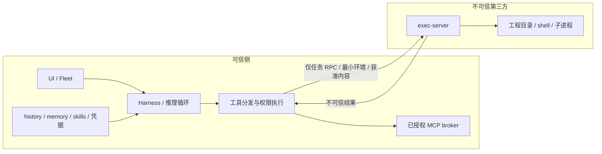

# RCA 远程执行安全审查与架构重选

> 最终实施方向以 [[remote-adapter/tool-boundary-implementation]] 为准：统一 remote 文件/执行工具，memory/skills 通过语义状态工具修改并审计。该报告包含后续新增的真实 Codex/Claude 接口实测。本文的漏洞证据继续有效；信息流分域仅是扩展讨论，不作为实施前提。

日期：2026-09-06。审查基线：`5661b05ccbe09a27e94448f34181888c9bbe548e`。

Boss，当前 RCA 能做执行位置适配，但不能作为抵御恶意命令、提示注入或模型主动绕过的安全沙盒。**最终约束：第三方执行机不可信；完整 harness、凭据、chat history、memory、skills 和已授权 MCP 都留在可信侧。** 初稿建议完整 harness 迁移到远端，不满足这一约束，已撤回。新的推荐是：可信侧强制绑定工具执行后端，第三方只接收获准的执行数据。

本次是审查和方案研究，不包含生产修复、部署或对真实凭据的访问。下文路径相对仓库根目录，行号对应上述基线。风险等级依据“本机及 executor 宿主需要受到保护”的目标；不是声称已发生入侵。

## 1. 威胁模型与根本矛盾

保护对象：本地真实 HOME、认证材料、Fleet 控制面、剪贴板与终端、本地其他工作区；远端宿主和其他任务；账号与网络服务权限。

不可信输入：模型工具参数、项目文件、依赖安装脚本、远端工具输出，以及这些内容诱发的后续工具调用。模型本身不应成为隔离策略的可信执行者。

当前链路：本地 harness → native 拦截器 → 本地 adapter → 远端 executor。部分请求直接回到本地文件系统或本地进程。模型驱动的 I/O 与 harness 的合法配置/认证 I/O 共享地址空间、身份和通道，路由器只能看路径、argv、cwd，无法证明调用的可信来源。

因此，“harness 需要写配置”不能推导为“模型可访问的整个配置目录允许写”；“Fleet hook 需要本地执行”不能推导为“包含 Fleet 字符串的 shell 可信”。即使模型不聪明，这种策略也不是访问控制；高能力模型只是更容易发现它。

## 2. 主要发现

### F1 / 严重：libp2p 身份认证没有转成执行授权

证据：`internal/transport/libp2p.go:120` 的 stream handler 接收所有连接流，没有客户端 PeerID grant 校验；`cmd/rca/serve.go` 直接将 listener 交给 executor；`internal/executor/executor.go:67` 按首字节分发 FS/exec。`internal/paircode/paircode.go` 的配对码携带 PeerID 和地址，不包含客户端授权秘密或批准流程。

Noise/TLS 可以认证对方持有其身份密钥，不能证明这个身份被 Boss 批准。知道服务地址和 PeerID、能够连通的客户端即可提交协议请求，不必攻破加密。实际暴露面取决于监听、防火墙和 relay 可达性；不能据此声称服务已被公网攻击。SSH stdio 的入口认证不同，但不解决后续权限过宽的问题。

**已实测**：通过 Go overlay 加入临时 `TestReviewUnapprovedPeerWrite`，仅在 loopback 创建真实 libp2p 服务和全新客户端身份；没有 grant/token/配对批准，客户端通过真实 FS stream 成功写入服务器临时 marker。测试通过（0.02s），没有连接部署中的服务。

建议：新 listener 在接收 FS/exec 前执行客户端 grant 校验；一次性配对批准绑定客户端公钥，签发有到期时间、撤销机制、任务/环境范围的 capability。握手失败立即断开。不能把公开地址重新命名成 token 就算修复。

### F2 / 严重：本地 argv / 二进制例外可以成为任意本地执行通道

证据：macOS `native/macos/rcc_interpose.c:485` 用 `strstr` 匹配 `tmux`、`pbcopy`、`codex-code-mode-host` 和自定义 binary；`:522` 在任意 argv token 中搜索 `RCC_LOCAL_ARGV_MARKS`；`:578` 的本地例外优先于远程 cwd 和 sentinel。Linux `native/linux/rcc_seccomp.c:162`、`:188`、`:235` 有对应逻辑。

**已实测 macOS**：编译基线 dylib，启动临时 C consumer，cwd 是配置的远程前缀。代理路径刻意设为不存在，以区分是否路由。命令仅用 shell 内建 printf 写临时 marker，末尾有无害注释标记。

| 条件 | 原生审计日志 | 结果 |
|---|---|---|
| 未配置匹配 argv mark | `route=1 reason=cwd-prefix` | spawn 返回 ENOENT=2，marker 不存在 |
| 配置匹配注释的 argv mark | `route=0 reason=local-argv-mark` | spawn 返回 0，本地 marker 存在 |
| 在 consumer 中直接 open 非 remote 前缀的临时文件 | 直接本地操作 | 两次均写成功 |

这是实际加载 dylib 的 OS 操作复现，不是仅测试复制出来的匹配函数。没有调用真实 Fleet hook，没有修改用户配置。端到端某个模型能否构造同样调用还受该 harness 的工具和权限限制；RCA 自己的边界已不足。

精确匹配 binary 路径能减少误匹配，却仍不能把 `tmux` 等具有启动进程能力的通用程序变成安全能力。长期应取消“可信 shell 文本”，使用受限的结构化控制面。

### F3 / 高：Linux seccomp 是执行路由通知器，不是限制 syscall 的沙盒

证据：`native/linux/rcc_seccomp.c:87` 起的 filter 除 execve/execveat 外一律 ALLOW；`:284` 明确放过 execveat；`:370` 在非 x86_64 上不做重写；读取寄存器/内存和写回失败时多处直接 return，继续原本执行。

`cmd/rca/nsrun_linux.go:92` 建立 mount namespace，在路径上挂 FUSE；它没有建立一个隐藏宿主 HOME/根文件系统的最小 rootfs。私有挂载视图能防止 FUSE 遮蔽其他宿主进程，不能禁止目标访问剩余宿主目录。部分路径不存在时，`:134` 附近的 MkdirAll 还会创建底层目录，mount namespace 不隔离文件内容。

这里的 execveat、arm64 和错误路径是直接静态证据，本次没有声称完成 Linux 原生运行复现。直接 syscall、继承 fd、符号链接、其他进程和 socket 都要由真正的 OS/VM 边界负责，不能靠继续枚举 syscall 补齐。

### F4 / 高：default-remote 不是贯穿各层的策略，且本地配置 pin 不区分读写

证据：`cmd/rca/run.go:243` 只为 Go routing.Table 切换模式；`:540` 向 native 传递 RemotePrefixes。macOS `is_remote`（`:171`）及 Linux 同名函数只检查 remote-prefix；macOS 前置判断未命中时根本不发 RPC。Linux FUSE 同样只覆盖显式 remote-prefix。

`internal/routing/routing.go:65` 是字符串路径路由；`internal/adapter/adapter.go:164` 对 local 直接调用 FSService。`cmd/rca/profile.go` 将整个 `.codex` / `.claude` 状态目录 pin 在本地，没有只读、操作种类、可信调用身份隔离。

所以改一个默认模式既不能保证全部请求远程，也不能让例外目录安全。filepath.Clean 只做词法清理，不等于解析符号链接后的对象授权；检查路径再 open 也不能自动解决竞态。

### F5 / 高：macOS interposition 不覆盖所有内核效果

证据：`native/macos/rcc_interpose.c:659` 起绑定的是有限的 libSystem 符号；`:655` 对裸名 execvp 直接透传；`:619` 在需要远程但 proxy 环境缺失时回到原 posix_spawn。`internal/adapter/launch.go` 复制、重签并去掉 hardened runtime 来允许注入；父子环境继承通用宿主权限。

DYLD interpose 是兼容机制，不是内核 reference monitor。不能把“已覆盖目前观察到的工具实现”外推为“任何后续版本或模型生成的原生程序都无旁路”。本报告未逐个运行 raw syscall / 动态加载绕过，结论不依赖这些未测路径。

### F6 / 高：跨 OS 自动去掉 Codex sandbox，没有安装替代边界

证据：`cmd/rca/profile.go:110` 注入 `-s danger-full-access`；`cmd/rca/run.go:508` 附近在跨 OS 时 prepend。原因真实：macOS sandbox-exec 无法在 Linux 执行。但 executor host 只有在外部确实隔离后才是合格边界。

不建议简单删 flag 恢复原始 exit 127。在第三方不可信的约束下，应由可信侧选择真正的远端执行后端，让执行域使用自己的平台语义；可信侧另设独立权限边界。不能移动完整 harness 来规避跨 OS 问题，也不能将关闭内层 sandbox 当作隔离完成。

### F7 / 高：executor 是该服务用户的通用 OS 权限，环境也会透传

证据：`internal/executor/fs.go:87` 原样 `os.OpenFile(req.Path,...)`，`:199` 原样 WriteFile，rename 等也未绑定 workspace 根；`internal/executor/exec.go:122` 起执行任意请求程序，SysProcAttr 只设进程组，未设置隔离；`cmd/rca/spawnproxy.go:59` 传 `os.Environ()`；`internal/executor/exec.go:227` 只过滤 DYLD 注入和 RCC 变量。

因此，进程继承到的其他 secret 会送到远端；请求 Env 为空又会使用 executor 自身环境。这里讨论的是变量传播行为，不是声称读取到了真实密钥。FS 限制目录也不能限制已经获准任意 exec 的用户，两者必须共享同一隔离域。

**已实测**：临时 `TestReviewSyntheticSecretPreserved` 调用基线 scrubInjectionEnv，输入合成 `SYNTHETIC_API_KEY=review-only` 和两项注入变量；注入变量被移除，合成 secret 保留。两个临时 Go 测试均通过，未改动仓库生产源码或原有测试文件。

建议：服务只能在任务容器/VM 内接受通用执行；明确最小环境 allowlist，按任务注入必要 secret。宿主控制进程不得兼任任意 exec/FS 服务。

## 3. 修订威胁模型：保护两侧边界

不能只要求“第三方 shell 不破坏我方电脑”，还必须要求“第三方宿主看不到完整 harness 私有状态”。不可信第三方即使提供 VM，也可以控制其宿主；普通 VM/容器不保护 guest 数据免受该宿主查看。除非另行引入并验证机密计算和 attestation，否则不向第三方放置这些私有数据。

三个不同目标必须分别验收：

1. **执行完整性**：模型不能在可信侧启动任意程序或写任意本地文件。
2. **状态保密性**：第三方不能获得状态目录、环境 secret、认证过的 MCP 连接或通用可信侧文件访问。
3. **输出信息流**：模型已经看到的私有内容，不能未经允许被编码进远端命令、stdin、文件或网络请求。

前两项可以依靠程序结构、权限和进程隔离实现硬边界。第三项不能从“shell 强制远端”推导出来：模型看到历史中的秘密 S，随后输出远程命令 `printf '%s' '<S>'`，第三方在收到命令时已获得 S，禁网也来不及。grep secret、让另一个模型审批都不能证明任意编码无泄漏。必须明确允许释放的数据范围；若要求严格不泄漏，则不让同一个拥有秘密上下文的自由编程模型直接控制任意外发字节。

## 4. 推荐架构：可信 brain + 强制工具后端 + 不可信 executor



核心不是“叫模型用 SSH”，而是 **模型拿不到 local exec capability**。SSH 可以是可信 adapter 预先建立的固定传输；模型调用普通 exec 工具时，其实现只能投递到绑定的远端环境。远端失联、参数不支持或协议不匹配时失败，不恢复 local backend，也不由模型选择连接地址或信任配置。

路径与权限分成明确类型：

| 类型 | 在哪里处理 | 允许来源 |
|---|---|---|
| HarnessState | 可信侧私有存储 | harness 内部状态 API |
| WorkspacePath | 绑定第三方环境 | 工具文件 API；绝对路径也不能切回可信侧 |
| LocalCapability | 可信侧独立 broker | 小范围结构化操作，禁止通用 shell/path |
| ReleasedContent | 第三方可接收数据 | 已获准的任务输入和产物，而非整份状态 |

**这些类型/身份必须由可信分发器赋予，不能让模型在 JSON 里写 `trusted:true` 或 `scope:internal` 来取得。** 把同一个具有本地权限的 Read/Write/Open 包装一下，不构成分域。

具体约束：

- 所有模型可触发的 shell、文件写入、apply_patch、图像读取、插件脚本、子 agent、Code Mode 中的 native 调用都使用绑定 backend 或受限 capability。
- history/session 的内部写入独立于模型文件工具；状态访问尽量进独立服务。harness 主进程作为可信计算基的一部分，需要逐项审查模型参数到本地 I/O 的路径。
- 本地 OS 约束作为纵深防御：harness 服务使用专用身份或可信侧 VM，缩小对真实用户 HOME 的权限；模型代码执行进程不继承该身份的状态文件、环境或控制 socket。仅对父进程加白名单、让子进程继承权限仍不合格。
- hooks 由可信生命周期事件触发固定实现，模型参数只作为数据；取消 shell 字符串命中特权。已授权 MCP 留在可信侧，按 server/tool/account/resource 配额授权，不给第三方反向调用整个 MCP 会话的入口。
- stdin/env/命令/文件内容都视为向第三方披露；不自动同步 skills 脚本或全局配置。私有 skill 需要远程脚本执行时，先决定是否允许披露该脚本，不能自动上传后声称 skills 留本地。
- 对远端返回的路径、错误、能力声明、插件清单均不信任；不能让它们触发本地插件安装、local path 读取或任意本地程序执行。
- 可信侧持有连接身份；使用 SSH 时禁 agent forwarding、自动环境/文件转发和未经配置的反向通道。不需要让第三方持有模型登录凭据。

## 5. Codex：发现比 remote Code Mode 更直接的既有结构

本次继续只读检查了本地 `/Users/hoveychen/workspace/codex`，工作区干净，源码基线 `315195492c80fdade38e917c18f9584efd599304`。它与已安装 `codex-cli 0.153.4` 不是同一版本证明：以下属于该源码快照证据；本机 CLI 另行验证了 `codex exec-server --help` 可用且标为 EXPERIMENTAL。

| 源码位置（相对 codex-rs） | 已核对行为 |
|---|---|
| `exec-server/src/process.rs:203` | `ExecBackend::start(ExecParams)` 将执行抽象为后端 |
| `file-system/src/lib.rs:404` | `ExecutorFileSystem` 是文件访问抽象 |
| `exec-server/src/environment.rs:666` | 远端 Environment 构造 RemoteProcess 后端 |
| `exec-server/src/environment_provider.rs:78` | 配置 remote URL 时，默认 provider 不包含 local environment |
| `exec-server/src/environment_toml.rs:28`、`:743` | 支持 `environments.toml`、`include_local=false`，并有 SSH stdio 配置测试 |
| `core/src/tools/handlers/mod.rs:157` | 显式 environment_id 不在已选环境中时返回 unknown 错误 |
| `core/src/tools/handlers/apply_patch.rs:375` | patch 校验使用所选环境的文件后端 |
| `core/src/tools/handlers/view_image.rs:137` | 图像 metadata/read_file 使用所选环境的文件后端 |
| `core/src/tools/runtimes/shell.rs:328` | 执行时传递绑定的 turn environment ID |
| `core/src/unified_exec/process_manager.rs:1098` | 通过 environment.get_exec_backend 执行 |

这些证据说明：Codex 已存在“可信 harness 与执行域分离”的正确切入点。**优先研究 exec-server / EnvironmentProvider，不能混同 app-server 整体迁移或仅移动 Code Mode host。** 后两者也不是完整执行域覆盖的证明。

源码中存在的配置形状如下，仅展示已读到的结构，未修改真实 CODEX_HOME 或连接第三方。`third-party-alias` 是部署时由可信管理员配置的固定 SSH 目的地：

```toml
default = "third-party"
include_local = false

[[environments]]
id = "third-party"
program = "ssh"
args = ["-T", "-o", "ForwardAgent=no", "third-party-alias", "codex exec-server --listen stdio"]
```

这仍不能直接宣布“安全完成”。要检查配置是否可由模型工具改写、model-facing 环境选择是否能重新加入 local、local MCP 和 hook 是否能提供旁路、控制面 API 是否被暴露，以及远端执行 env/快照是否泄漏可信状态。某个 backend 的注入点正确，不代表整个 harness 已审计完毕。

新原型的最低验收：固定源码/二进制版本，使用干净测试状态和合成 secret；先覆盖 shell/apply_patch/read/image，再覆盖 Code Mode、MCP、hooks、plugins、subagents；抓取出站 RPC 确认没有状态/环境自动外传；请求 `environment_id=local` 和远端断连均不能触发本地 I/O。使用恶意结果与假环境元数据反向测试可信侧。

## 6. Claude / 开放 harness 的取舍与不能承诺的部分

Claude 官方 SDK 提供 loop 和工具控制入口，但本次未确认一个覆盖所有原生工具的可替换 FS/process backend。可行选项按顺序是：

1. 验证该版本是否能以实际工具注册/权限机制关闭全部内置本地执行能力，再提供远端工具。这里的“关闭”必须由实现拒绝，不能是 prompt 说不要用；hooks、MCP、内部 helper 仍需覆盖测试。保留原生工具完整兼容性不作先验承诺。
2. 若无法完整替换，在可信侧运行受 OS 约束的专用 harness 实例，并收窄 broker；这能保护其他本地系统，但若同一闭源进程既有私有状态权限又有模型可控任意 I/O，仍不能证明状态分离。不能拿容器名称掩盖这一缺口。
3. 接受维护 fork（有源码时）或自建开放 harness。把工具调用、状态存储、凭据、MCP 分域做成接口，承担上下文、会话恢复、审批、子 agent 等能力的维护成本。

如果坚持同时满足“完全不改闭源 harness、全部原生功能无损、完整私有状态在同一进程可访问、模型可触发任意通用本地工具、又要求模型绝无访问私有状态的能力”，这些要求互相冲突。必须撤销模型通用本地能力或改执行边界，不能靠更长的 syscall 白名单解决。

Boss 提到的 DeepSeek harness 按“可控制 agent loop 与后端的开放架构”理解，未评测具体仓库。这种架构确实更自然：宿主内部状态 API 与模型 workspace API 根本不是同一个对象；既不需要猜测某个 open 的意图，也不需要基于 shell 文本识别可信 hook。

若还要求强输出保密：将完整私有上下文留给 planner；worker 只接收明确释放的任务上下文。注意，planner 若能自由生成 worker prompt/代码，同样可以把秘密藏进去，所以 planner→worker 也必须有明确的数据释放边界。可选手段是人工批准释放内容、按能力提供固定结构的最小结果，或限制私有信息从不进入可以任意外发的模型上下文。不能把“双 agent”或 LLM 审批本身当保密证明。

**修订后的实现优先级**：保留 RCA 的连接与流式传输经验；优先验证 Codex 既有 exec-server 的 remote-only 执行域，并在可信侧补齐 capability / 状态分域；Claude 单独验证工具替换覆盖，不能再承诺一个引擎无关的 native hijack 同时保留全部私有状态与完整原生功能。F1 的连接授权漏洞和 F7 的环境透传仍需独立修复，不能因为更换架构而忽略。

## 7. 官方资料与验证限度

- [Codex app-server](https://developers.openai.com/codex/app-server)：公开实现、remote UI/Code Mode、协议及实验性限制。
- [Codex approvals & security](https://learn.chatgpt.com/docs/agent-approvals-security)：OS sandbox、容器外层边界、容器内凭据风险。
- [Claude Code sandboxing](https://code.claude.com/docs/en/sandboxing)：Bash scope、Seatbelt/bubblewrap、unsandboxed 例外。
- [Claude Agent SDK overview](https://platform.claude.com/docs/en/agent-sdk/overview)：SDK 暴露的 loop、工具和会话能力。

以上页面本次实际抓取正文；Claude 的 `.md` URL 返回 403，改用 HTML 正文读取成功。未评测某个 DeepSeek 仓库，未验证全部 harness 版本，未进行真实生产端攻击或完整隔离原型实测。本报告给出可证伪的设计和验收目标，不承诺绝对安全。

已回顾历史知识库 [[remote-adapter/codex-support]]：其中将 adapter 称为“外部沙箱”的表述不成立，本报告纠正其安全定位；历史文档本身也记录了 native default-remote 缺口。启动成功、认证文件可读和远程工具执行成功是兼容性证据，不是安全隔离证据。
