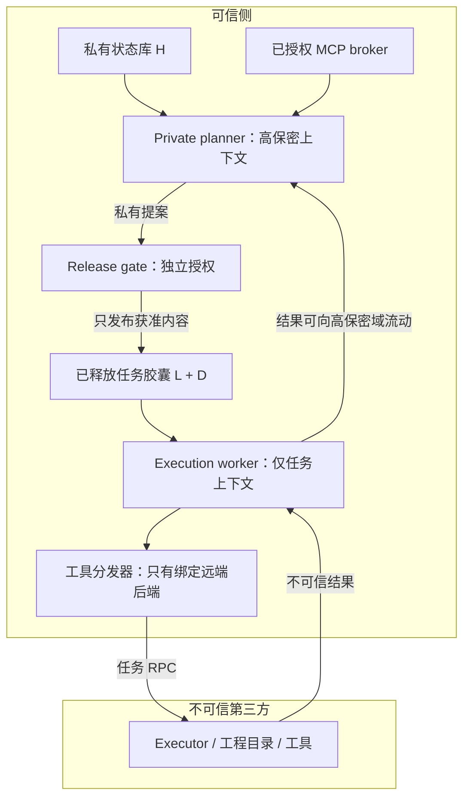

# 私有 harness 与不可信第三方执行机：严格防泄密设计

> **未采用的扩展设计。** Boss 已明确回到单一完整 harness 上下文、有限工具代理、memory/skills 变更审计的实现模型。本文的 planner/worker/数据释放方案不进入本轮实现，不构成额外审批要求。最终路线见 [[remote-adapter/tool-boundary-implementation]]。

日期：2026-09-06。关联审查：[[remote-adapter/isolation-review]]。

Boss，本设计保留完整 harness 状态在可信侧。第三方只执行明确允许其看到的任务，不能访问历史、memory、私有 skills 或已授权 MCP。模型不承担权限执行责任。

**核心规则：获得私有信息的模型输出、程序和控制决策，都按私有信息处理。要交给第三方，必须经过独立的数据释放授权。** 不能根据输出文字是否含有 secret 来决定；编码、推断、分支和延时都可能携带信息。

## 1. 能保证什么，不能同时要求什么

设 H 是不得给第三方的私有状态，L 是第三方已获准看到的任务上下文，D 是明确获准释放的额外数据。要求是：固定 L、D 和公开运行条件，改变未释放的 H，不应改变第三方能观察到的应用层交互分布。

这是一个系统性质，不是要求模型“答得谨慎”。例如模型读取私有 bit 后，在远端分别运行 `true` 或 `false`，虽未输出任何敏感词，仍泄露了 1 bit。文件名、命令排序、选择哪个公开模板也存在同样的问题。

以下三项无法同时保留：

1. 一个 agent 自动读取全部私有状态。
2. 它不受约束地决定第三方可见的命令/代码/调度。
3. 未释放的私有状态严格不泄漏给第三方。

要保留第 3 项，就要拆分上下文和执行权限，或者在第 2 项的跨界动作上设置真实的数据释放边界。公开 harness 让边界更容易实现，并不消除这个约束。

## 2. 攻击者与信任假设

第三方控制 executor、宿主 OS、磁盘、日志和返回值。假设它能看到发给它的全部命令、argv、stdin、env、文件、RPC 字段、请求顺序和应用层调度。TLS/SSH 防链路窃听，不防最终接收方。

私有上下文里的模型也不能被信任会遵守保密要求；它可能受提示注入影响，也可能主动试图外传。所有被模型生成的代码均不可信。模型输出只影响其获得的能力，不能影响策略、标签、授权签名或对象归属。

可信计算基包括：策略执行器、状态服务、release gate、MCP broker、隔离平台、可信 UI 和模型推理服务。如果模型服务商本身也不可信，把 H 发给其 API 已经泄漏；需要另选可信推理部署，这不是 executor 代理能弥补的。

本设计首先保证应用层显式数据和控制通道。共享 CPU/cache、资源争用等微架构侧信道不由本文的协议规则消除。严格模式应隔离资源，不让私有计算负载控制第三方交互调度；若还要求隐藏任务存在、包大小和时间，需要固定节拍、padding、cover traffic 及单独验证。不能把“内容不外传”表述成“完全不存在任何侧信道”。

## 3. 分域：两个模型角色都在可信侧运行



这里的 worker 也在可信侧；第三方不需要运行模型、存储 chat history 或持有模型 API key。两个角色最好是不同进程/身份和独立模型会话，不是同一 conversation 加两段提示词。

Private planner 可以使用 Boss 的完整历史、memory、skills 和获准 MCP；它没有第三方 exec、文件上传、通用网络出站或可向 worker 直接发自由文本的能力。其提案留在可信侧。

Worker 使用全新、可审计的任务上下文，不继承 planner history、memory、私有 skills、会话恢复数据或本地 MCP。它可以自主写代码、测试和迭代，但只能看到任务胶囊和第三方结果，工具只连接被绑定的 executor。

分域必须在工具调用和消息交接处实施：私有 planner 的 subagent 不能继承低保密权限；创建 worker 必须经受信上下文构造器；代码运行时的 store/load、跨 agent message、共享文件、历史检索和缓存不得成为隐式共享通道。

## 4. 标签、完整性与能力

不要把“私有/公开”交给模型填写。标签保存在服务端对象表，模型只得到受限 handle。

| 对象 | 保密标签 | 完整性 / 含义 |
|---|---|---|
| 完整历史、memory、凭据、私有 skill | Private(owner, scope) | 是否可信还须单独判断 |
| 给某第三方的任务胶囊 | Released(task, recipient, revision) | 由 release gate 签发 |
| 第三方 stdout/文件/元数据 | Task(task, recipient) | Untrusted；不能改变策略 |
| Planner 的模型响应/计划/代码 | 所有输入保密标签的合并 | 私有输入一旦出现，输出整体私有 |
| Worker 的模型响应/代码 | 任务域及所有追加输入的合并 | 可交同一第三方，不可跨任务 |
| MCP credential | Private + NeverExport | 原始字节不进入模型上下文 |

保密与完整性是两条轴。第三方输出可以不是秘密，但永远不因此成为可信授权；私有历史也可能包含恶意提示。禁止“保密标签低，所以能当命令/策略执行”的混淆。

对 LLM 使用保守的**整个上下文标签传播**。不尝试逐 token 猜信息来源：若 prompt 中出现 Private，全部生成输出都标 Private。base64、hash、摘要、翻译、推理、选择模板都不会降级。生成的程序连同运行时输入、分支控制一起传播标签。

固定任意程序在可信侧运行不代表输出安全。尤其不能让 planner 提交“清洗函数/SQL/projection”并由 broker 执行后宣布结果已脱敏；程序本身也可能是编码器。

## 5. 数据释放：模型只能提案，不能授权

释放是明确允许第三方得知某些信息，通常称为 declassification。系统要准确记录披露的对象、接收方和有效期，而不是给一张永久的“可信任务”票。

两种合法入口：

### A. Boss 批准具体任务胶囊

可信 UI 展示：第三方身份、任务文本、文件树与文件大小、完整待发对象、环境、MCP 数据产品、允许的动作和泄漏元数据范围。它不只展示模型自己的摘要；被执行内容和被批准内容必须是同一不可变版本。

一个胶囊可包含：任务 prompt、准许发送的 repo snapshot、公开 skills 副本、选定文件、必要测试配置、预算。批准后 worker 可在胶囊范围内自主执行，不逐条 shell 询问。planner 想追加私有诊断或 patch，就产生新版本胶囊。

人工批准表示接受此次披露，**不表示 UI 能自动证明代码没有隐写秘密**。面对恶意 planner，任意大代码/文本的人审也不能充当形式化防泄漏算法。对不允许泄漏的绝密数据，应禁止其进入用于生成释放物的模型上下文，而不是寄希望于逐字检查。

### B. 预先授权的固定数据产品

比如管理员在可信侧实现一个固定查询，只返回某个项目明确允许公开的依赖版本列表。授权绑定数据源、scope、固定实现版本、接收方和字段集合。参数使用有限的允许集合；不接受 planner 自带 SQL、正则、脚本、任意路径或输出模板。

这不是“清洗后就不算泄漏”，而是预先允许释放该函数揭示的信息。聚合值、布尔值、错误差异和重复查询也可能泄漏；必须一起纳入产品授权和查询预算。预算限制泄漏量，不把它变成零。

若私有 planner 依据秘密决定调用哪个数据产品、何时调用，其选择本身是信息。因此自动低保密工作流的数据产品调用必须由公开任务和低保密 worker 决定，或把这个选择也纳入明确授权；不能让高保密 planner 随意控制低保密调度。

### Release capability 的绑定

由可信 authority 签名的 capability 至少绑定：

```text
issuer, recipient_id, task_id, capsule_revision,
manifest_digest, object_digests, allowed_operations,
policy_revision, expiry, nonce, max_uses
```

完整 manifest 是批准对象；传输前校验签名、任务和接收方、对象内容 digest、有效期、用途和使用次数。nonce 原子消费，拒绝重放；数据在批准前即不可变，或以读取快照校验，禁止批准后替换文件/符号链接。撤销阻止未来发送，不能撤回已经被第三方读取的内容。

这些字段是目标协议，不是 RCA 现有已实现特性。

## 6. 协议与拒绝规则

建议将可信状态 API、模型 workspace API、管理 API 分成不同服务端点和权限根。即使复用传输也不共用全权会话。

```text
Model-facing worker API:
  exec(argv, cwd_handle, env_delta, stdin_handle)
  read_file(workspace_handle, relative_path)
  write_file(workspace_handle, relative_path, content_handle)
  apply_patch(workspace_handle, patch_handle)

Private planner API:
  read_private_state(scoped_handle)
  call_private_mcp(capability_handle, typed_args)
  propose_release(proposal_handles)

Trusted-only API:
  authorize_capsule(immutable_manifest, recipient, task)
  create_worker(authorized_capsule)
  bind_executor(task, authenticated_endpoint)
```

模型接口不接收可改变执行域的 host、socket、backend、trusted flag 或任意本地路径；task 与 recipient 从认证连接和 worker 身份派生。客户端自报 labels 一律忽略或拒绝。

拒绝条件包括：

- 高保密输出进入第三方 sink，没有匹配的 release capability。
- 任务 A 的对象/会话 handle 用在任务 B，或接收方不同。
- stdin、env、文件名、argv、patch 中任何输入包含未释放对象。
- 高保密代码决定原本低保密数据的分支、命令、调度或目标。
- 请求 unknown/local backend、失联后要求本地 fallback。
- 第三方响应要求读取本地文件、导入插件、回调通用本地 exec 或调用私有 MCP。
- capability 过期、撤销、被重复使用、manifest 版本变更。

远端 response 即使含有有效样式的 JSON/RPC，也只能作为与原 request_id 对应的结果处理；第三方没有发起管理调用的权限。限制响应长度、解析复杂度和超时；禁止隐式反序列化为可执行对象。

## 7. MCP 与技能怎么保留

“token 没给第三方”只解决一部分问题。一个持有认证的本地 MCP 若能被 worker 任意调用，仍然提供了访问私有数据的能力。

默认：私有 MCP 只提供给 planner，返回结果标为 Private。worker 无法列举、调用或持有其句柄。必要的 task-scoped MCP 数据走固定数据产品，结果属于明确释放内容。禁止 worker 通过 MCP 的 shell、文件、网络、数据库查询工具绕回可信侧。

同样，完整私有 skills 留 planner。worker 只能加载胶囊中的 skills。允许一个私有技能“指导”worker 的结果，本身可能披露该技能的内容/逻辑；如果生成代码必须发给第三方，就把相应输出作为允许的披露来决策。不存在既任意应用秘密算法并把完整实现交给第三方、又保证算法实现不被第三方看到的通用办法。

## 8. 两种可用的产品工作流

### 工作流 1：完整私有助手 + 自主任务 worker（推荐）

Boss 在可信侧与 planner 讨论；planner 基于历史提出任务胶囊。批准一次之后，worker 仅靠胶囊在第三方自动开发、测试。结果回到 planner 做私有分析；新的私有指导需释放新的胶囊。

优点是常见执行阶段保持自主。代价是 worker 无法随时无条件访问所有私有记忆和 MCP。审批的是跨边界信息，不是每一条 shell；对一项明确授权的任务可预先批准范围，减少重复操作。

### 工作流 2：单个完整私有 agent，第三方发送前冻结审核

保留现有完整上下文体验，但它的所有远端动作先成为可信侧私有提案；任务管理员按批次授权实际发送内容。安全意义是“明确允许这批披露”，而不是一个自动化防泄漏证明。更适合少量高价值操作，自动化程度低。

如果 Boss 不接受任何额外释放环节，又要求 agent 自动自由运用所有私有状态，能提供的是风险降低和审计，不能将其命名为严格防泄密。

## 9. 与当前项目及 Codex 的接入关系

RCA 的 syscall hijack 无法知道模型当前上下文标签、状态对象归属或释放授权，不适合作为这层信息流执行器。现有 F1 授权和 F7 env 透传问题仍需处理；更换工具后端也不会自动解决它们。

Codex 的 remote-only execution environment 适合实现 worker 的执行边界。完整可信 planner 保留自己的状态和 MCP；worker 使用独立 CODEX_HOME/模型会话/配置，并只导入胶囊内容。两个进程可以使用受信模型认证 broker，而不向第三方提供模型凭据。必须验证控制进程身份不能让 worker 读取 planner 文件、进程内存或同用户 socket。

不要仅在同一 Codex conversation 里 spawn 一个“请勿看历史”的子 agent；如果它继承历史或能访问相同 memory/MCP，保密标签仍为 Private。若现成 harness 不允许构造真正独立上下文，需要 fork 或自建会话编排层。

Claude 同理：优先验证独立 worker 会话和工具能力集合能否被实现强制限制。没有完整可验证替换能力时，不用 prompt 和 hooks 字符串例外补成“严格模式”。

## 10. 可执行验收与实施范围

先实现独立的小型信息流参考模型验证规则，再用同样案例测试真实 harness。参考模型通过只证明规则内部一致，不证明实际 OS、LLM、协议和全部插件已经接入。

最小验收用例：

| 用例 | 预期 |
|---|---|
| Planner 把合成 secret 直接发远端 | 拒绝 |
| base64 / hash / 摘要输出 | 仍为 Private，拒绝 |
| 根据 secret bit 在两个公开命令间选择 | 高保密控制依赖，拒绝 |
| 输入 MCP 私有结果后 worker 再发命令 | 会话整体升为 Private，拒绝；正常产品应在输入前阻止此混入 |
| JSON 自报 public/trusted、第三方伪造管理消息 | 不改变服务端标签或授权 |
| 完全独立低保密 worker 自主编程 | 同任务/同接收方允许 |
| 获准发布的精确对象 | 允许一次绑定的用途 |
| 替换对象、跨任务、换接收方、重放、过期 | 拒绝 |
| Planner 控制任务取消/执行时间来传 bit | 禁止跨域控制，或明确释放此控制信息 |
| 第三方断连、版本不支持 | 显式错误，可信侧无本地执行 |

真实集成还需抓取第三方接收的完整 transcript，比较不同合成 H 下的公开交互；给 LLM 固定可控采样或分析分布。两次实跑“没看到秘密”是回归证据，不是非干扰证明。要审查权限图，确保不存在未纳入监控的出口。

上线前应明确交付声明：保护哪些状态、允许披露哪些任务数据、有哪些元数据通道、对哪些 harness/插件版本做过覆盖测试。没有经过测试的模式只称实验模式，不能将一次参考模型测试扩大成对完整产品的安全背书。

## 11. 本次验证结果与后续工程边界

在临时目录运行 Python 参考模型，**14 个测试通过**。模型使用服务端对象表、整个上下文保密标签传播、task/recipient 绑定和 HMAC 签名的一次性释放许可。测试覆盖直接输出、base64、hash、命令/调度控制标签、伪造公开标签、私有 MCP 上下文污染、干净 worker、跨任务、跨接收方、精确释放、重放、替换、过期和签名伪造。

没有调用真实模型、MCP 或第三方服务，所有 secret 都是合成值。最后一个不同 secret 的对照用例只是小型规则回归：固定低保密输入时输出一致，不能外推为对任意真实模型的非干扰证明。

参考程序的 trusted_store/trusted_authorize 是模拟受信调用者的函数，并非 Python 提供了安全隔离。真正实现必须放在不同权限域，模型不能 import/call 它们；nonce 消费必须事务化，标签和 key 不能共享给不可信代码。调度测试验证的是受标签约束的动作对象，不验证真实网络的时序侧信道。

下一轮工程应先交付三个相互独立的边界：

1. **干净 worker 构造器**：独立身份、状态目录和模型上下文；无 planner 文件/socket/MCP；绑定 remote-only backend。用合成 canary 验证所有入口不可访问私有状态。
2. **不可变任务包与 release gate**：签发精确版本、任务、接收方和用途的许可；发送路径强制检查，覆盖 argv、stdin、env、文件和任务控制。
3. **真实工具出口清单与审计**：覆盖 shell、FS、Code Mode、MCP、hooks、子 agent、插件、网络和制品导入；不存在清单外出口才允许启用严格模式。

前两项的代码通过单测，也不能跳过第 3 项。通用“对模型输出做脱敏”的过滤器不作为这些边界的替代交付。
