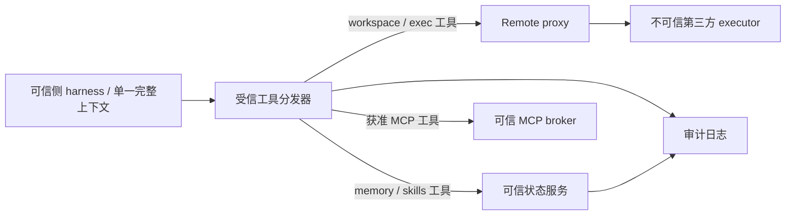

# RCA 重做实现路径：工具统一代理与状态变更审计

日期：2026-09-06。Boss 最终明确的目标是：

1. 模型可触发的通用文件操作只通过有限工具进入。
2. 这些工具的实现强制代理到不可信第三方，模型无法选择本地 fallback。
3. memory、skills 等状态修改通过专门工具/操作入口，不能以本地路径例外绕过审计。

完整 harness、历史、凭据和已授权 MCP 留在可信侧。**本方案不引入 private planner / 干净 worker / 数据释放审批的产品模型。** 之前的信息流设计扩展了问题范围，不是本次采用的路线。

结论：这条实现路径存在，且厂商云并未锁住所有入口。Codex 有可自托管的 exec-server 和可改造的状态接口；Claude 可以移除内置工具、仅暴露自定义 MCP。真正仍受封闭性限制的是：把所有内部自动状态写入也纳入同一机制，同时无损保留原生功能。

## 1. 本次新增的实测证据

### Codex 0.153.4：自托管 stdio 后端可用

使用临时 HOME、独立 harness/executor CODEX_HOME，未使用真实凭据、未调用模型。可信 app-server 通过配置的 program 启动另一个 exec-server 进程，以 stdio 通信。

实测结果：

```text
initialize -> rca_review/0.153.4
environment/info("third-party") -> cwd = 临时目录/remote-work
environment/info("local") -> -32600, unknown environment id `local`
```

这里的“remote”是后端角色：两个进程在本机不同临时配置下，**不是跨主机或内核隔离测试**。它证明可以脱离厂商云注册连接自行启动的执行后端，以及注册表可以不含 local。

另一个直接协议探针成功执行 `process/start`，`process/read` 返回 stdout `SELFHOST_EXEC`。退出清理等待超时；尝试补 `--exit-on-stdin-close` 后发现该参数要求 `--remote` 与 `--environment-id`，不适用于本次 stdio 用法。按失败规则停止追加测试。**没有完成追加的 fs/readFile/writeFile 实测，也没有把整轮测试标为全绿。** 已核查无遗留 exec-server 探针进程。

独立 exec-server 可以自托管，不等于所有 Codex 功能都已经远端化；模型工具、hooks、MCP、内部 maintenance 各自仍需验收。

### Claude Code 2.1.261：关闭内置工具，保留 MCP，实际拒绝 Bash

使用临时 HOME/CLAUDE_CONFIG_DIR、仅绑定 loopback 的模拟 Anthropic SSE 服务、合成 API key 和一个测试 MCP。没有请求真实模型服务。运行真实 Claude 二进制，主要参数为：

```text
--bare --tools "" --strict-mcp-config --mcp-config <临时配置>
--allowedTools mcp__rca__workspace_read
--no-session-persistence --max-turns 3 -p
```

两次捕获到的模型请求，其工具列表都**只有** `mcp__rca__workspace_read`。

| 模拟模型返回 | 真实 harness 行为 |
|---|---|
| 调用 workspace_read | MCP 收到调用，返回 `SYNTHETIC_REMOTE_RESULT`，结果进入下一次模型请求 |
| 强行调用未注册的 Bash，尝试写临时 marker | 返回工具错误，marker 不存在，测试 MCP 也未收到 Bash |

实际错误：

```text
Error: No such tool available: Bash. Bash is disabled for this session,
in subagents as well as here.
```

两次 CLI 均退出 0。模拟模型输出固定，不依赖模型“愿意遵守”禁止 Bash 的提示。错误文案提到 subagents，但本次未实际创建 subagent，不将其当子 agent 覆盖测试。

测试 MCP 返回合成内容，没有连接实际远端 FS；实测证明的是工具注册、调用和拒绝机制。下一步将此 MCP 接到 RCA 协议是产品工程，尚未实现。

`--bare` 在本版本只接受 API key / 显式 apiKeyHelper 等认证路径，不能直接套到需要 OAuth/keychain 和原生自定义功能的产品启动流程。本次用它隔离测试环境，不声称必须改变 Boss 的登录方式。

## 2. 目标工具面：通用文件与语义状态分别收口



工具建议如下；这是目标 API，不是当前已存在的 RCA 子命令：

| 工具 | 后端 | 参数边界 |
|---|---|---|
| `workspace.read`、`workspace.list`、`workspace.search` | 远端 | task 绑定的工作区路径 |
| `workspace.write`、`workspace.apply_patch` | 远端 | 明确文件内容/patch，限制消息大小 |
| `exec.start`、`exec.write_stdin`、`exec.cancel` | 远端 | argv/cwd/env，task 绑定的 process handle |
| `memory.list/read/search`、`memory.upsert/delete` | 可信状态服务 | 逻辑 memory ID、scope、expected_revision |
| `skills.list/read`、`skills.put/delete` | 可信状态服务 | skill/package ID、版本和内容 |

关键区别：`memory.upsert(id, content)` 不暴露任意宿主文件名，也不是向 filesystem 白名单新增 `~/.codex`。模型仍无法用 `workspace.write("~/.codex/...")` 修改可信状态，因为这始终是远端路径。

文件工具默认全部 remote，状态工具默认只能操作自己的逻辑对象。authority/task/backend 由受信会话绑定，不能由模型传 `local=true` 或自报身份。

维持一个完整模型上下文即可；不必为了工具权限拆出另一个无记忆 worker。这里承诺的是工具访问控制和可审计变更，不扩大成“任何被模型看到的信息都不可能出现在输出中”的信息流性质。

## 3. Codex 的具体实现路径

### 3.1 现成远端执行域，先替换当前 native hijack

源码已核查于本地干净 checkout `315195492c80fdade38e917c18f9584efd599304`，与安装的 0.153.4 分别标注，不假定两者完全一致。

`$CODEX_HOME/environments.toml` 支持：

```toml
default = "third-party"
include_local = false

[[environments]]
id = "third-party"
program = "ssh"
args = ["-T", "-o", "ForwardAgent=no", "third-party-alias", "codex exec-server --listen stdio"]
```

`third-party-alias` 是管理员预配置的连接目标，不是模型可选参数。此 SSH 形状存在于源码配置测试；本次实跑使用同样的 program/args stdio 机制启动本机独立进程，未执行这条跨主机 SSH 示例。

不需要使用 `codex exec-server --remote <厂商 registry>`。`--remote` 是另一种注册/relay 方式；独立 stdio/websocket 是单独入口。模型调用的是 shell/文件工具，SSH 只由受信启动器执行，硬边界在工具后端绑定。

具体代码接入点（相对 codex-rs）：

- `exec-server/src/environment_toml.rs`：管理员执行域注册。
- `exec-server/src/environment_provider.rs`：禁止 local 环境加入。
- `exec-server/src/environment.rs`：RemoteProcess 与 RemoteFileSystem 绑定。
- `core/src/tools/handlers/mod.rs:157`：拒绝不存在的 environment ID。
- `core/src/unified_exec/process_manager.rs:1098`：真正的远端进程 start。
- `core/src/tools/handlers/apply_patch.rs:375`、`view_image.rs:137`：文件工具后端。

若要复用 RCA 的 libp2p/stdio 通道，有两种选择：先承载原生 exec-server 字节流，或实现其协议到 RCA 协议的转换。前者少一层语义映射，优先考虑；版本须锁定，不能将两种协议直接混用。

### 3.2 Memory 已有接口，但默认后端和后台写入需要改

`ext/memories/src/backend.rs:9` 定义 `MemoriesBackend`：`add_ad_hoc_note/list/read/search`。这已经是语义状态工具层，替换为调用可信状态服务的实现即可，不需要在 open syscall 上猜测访问意图。

`ext/memories/src/extension.rs:112` 当前实例化 `LocalMemoriesBackend::from_codex_home`，这里需要改为可注入的 backend。`ext/memories/src/local/ad_hoc_note.rs:28` 直接 OpenOptions 写文件，确认了现有本地实现的位置。

另外还有独立的自动 memory pipeline：

- `memories/write/src/storage.rs:54,77,135` 直接写 raw memories / rollout summaries。
- `memories/write/src/workspace.rs` 创建、写入和删除 memory workspace 文件。
- `memories/write/src/phase2.rs:315` 起构造 consolidation agent，并为本地 memory root 配置写权限。

**只替换 model-facing memory tool，不会消除这些内部路径。** 两个可落地的阶段：

1. 暂停原生自动生成/合并，只保留可信上下文读取和显式 memory 工具，把原来记忆能力的写入交给状态服务。
2. 恢复自动整理时，把其产物变成同一 `memory.upsert/delete` 操作，带 `actor=memory-maintenance`、源 thread/turn、before/after revision。不要让 consolidation agent 持有可写的真实 memory 目录。

源码中有 `features.memories` 和 `memories.generate_memories` 等控制点，但关闭哪些开关会影响读取工具需要对目标版本验证；不得把“全关 memory feature”误报成“完整保留原生 memory 行为”。

### 3.3 Skills 可走 provider；写入另建语义工具

`ext/skills/src/provider.rs` 已有 `SkillProvider::list/read/search`，包含 Host、Executor、Orchestrator 三类 provider，并明确要求维持 authority 边界。

可以让可信侧 skills 从 Orchestrator/provider 服务读取，或给 Host provider 注入只读版本快照。新增 `skills.put/delete` 通过状态服务提交版本，后续由 provider 刷新。不能继续让模型通过普通 Write/Edit 修改宿主 SKILL.md。

脚本执行必须有明确去向：skill 中要运行的程序通过远端 exec 工具执行；如果依赖本地特权，必须定义一个专用可审计 capability，不能恢复通用本地 shell。插件安装、配置更新、自动依赖安装也属于状态变更入口，需要禁用或接入同一机制。

### 3.4 最小 fork 的范围

无需重写 Codex 推理循环，建议只维护三类改动：

1. 固定执行域策略，禁止模型/会话 API 引入 local fallback。
2. 注入 memory/skills 状态服务，并接管或暂停后台生成路径。
3. 统一状态操作审计与版本化提交，维护模型工具注册白名单。

现成配置可完成远端后端接线；全部内部写入收口尚未发现一个现成配置开关。为完成第三条要求，源码改造比 hook 拦截更可靠。

## 4. Claude 的具体实现路径

### 4.1 能直接做：自定义 MCP 工具接管文件和执行

`--tools ""` 控制的是可用内置工具集合。`--allowedTools` 只是权限允许规则，不能替代前者。实测已经确认内置 Bash 不在集合时，即使模型硬输出该工具名，也不会执行。

RCA 新增一个可信侧 MCP frontend，暴露第 2 节的工具：workspace/exec 转发现有 remote executor；memory/skills 交给可信状态服务。这些自定义 MCP 由 `--strict-mcp-config --mcp-config` 显式注入。

最小原型可从本次已验证的启动组合开始。生产启动要保留既有账号认证和完整上下文，不直接照搬 `--bare`；可以评估本版本的 `--restricted` 与显式配置，但其完整组合尚未实测。使用工具注册机制实现禁止，prompt 只说明工具用途。

### 4.2 Memory/skills 的替换

官方 memory 文档提供 `CLAUDE_CODE_DISABLE_AUTO_MEMORY=1` / `autoMemoryEnabled=false`。关闭自动 memory 后，用 `memory.read/search/upsert` 保留产品层的记忆功能；需要初始上下文时，由可信编排器读取状态服务并注入。既有历史仍留可信侧。

skills 同样通过 `skills.list/read/put` 暴露；`--disable-slash-commands` 可关闭原生 skills，再由自己的工具/provider 提供。需要保留 slash UX 时，可在外部 UI 映射到相同服务。它不等于原生 Skill 工具无损迁移，尤其 forked skills、脚本、agent frontmatter 需要兼容性实现。

hooks、插件、自动刷新和导入不得偷偷写这些状态根。应使用受控配置/只读快照，并逐项测试；闭源条件下无法凭配置文档证明所有内部写路径不存在。

### 4.3 为什么不使用 PreToolUse 做透明 remote replacement

已读官方 hooks 文档：PreToolUse 能 allow/deny/ask/defer 和 updatedInput；PostToolUse 的 updatedToolOutput 可以修改返回内容。但 PostToolUse 发生在原工具执行之后，不能撤销原文件修改。PreToolUse deny 并塞入结果也只是错误/附加上下文，不是正常工具实现替换。

hook 故障的部分路径还会按非阻塞错误处理。因此 hooks 可用于日志和辅助策略，不承担唯一的执行代理和失败拒绝边界。

移除原工具 + 注册自己的工具，比伪造原工具的输入/结果更直接。代价是工具名、schema 和部分原生 UX 改变；若要求原生工具全部无损保留并更换所有内部存储后端，闭源 CLI 当前没有本次已验证的通用扩展接口。

## 5. 统一状态服务与审计：避免另一种白名单

服务建议采用逻辑对象模型：

```text
StateMutation {
  request_id, session_id, turn_id,
  actor: model | memory-maintenance | user,
  object_kind: memory | skill,
  object_id, scope, expected_revision,
  operation: put | delete,
  content
}
```

actor/session/scope 从受信连接派生。操作通过后，状态提交与审计记录在同一事务或可恢复 WAL 中持久化；审计不可用就不能提交。记录 before/after revision、内容摘要、来源调用与结果。重复 request_id 返回同一结果，CAS 防并发静默覆盖。

状态服务独占可写存储权限；harness 只拿读取视图和语义 API，不能同时保留真实目录的可写路径，否则“所有变更经过工具”只是约定。用户显式配置更新和后台整理也走同一服务，UI 可展示后台 actor，不能为了让每次变更看起来像模型调用而伪造 tool_call。

chat history、日志和认证刷新是另一类 harness 内部存储。如果要求它们同样全部审计，就接入自己的 SessionStore/CredentialStore；不能冒充 memory 工具记录。需要的边界是：模型不能通过任意文件工具改写它们；自动内部写入也有清晰的来源和权限。闭源 harness 的全部磁盘 I/O 若都必须收口，则只能关闭其持久化、由外层保存 session，或更换可控实现，并接受 resume 兼容性成本。

对于不可信 remote，审计日志只能证明“我方发送了请求、收到该返回”，不能证明第三方宿主真的按声明执行。连接授权仍需修复；消息超限、协议错误、后端失联不得回落本地。执行重试要区分结果未知和未开始，不能盲目重复有副作用命令。

## 6. 现成能力、必要改造与封闭限制

| 要求 | Codex | Claude Code |
|---|---|---|
| 不使用厂商云的 remote 连接 | 已实测独立 exec-server stdio | 自定义 MCP frontend 可接自己的 remote；工具注册已实测 |
| 移除模型通用本地执行能力 | remote-only 环境已有机制，待全入口覆盖测试 | `--tools ""` + 自定义 MCP，Bash 拒绝已实测 |
| Memory/skills 明确工具化 | 有 backend/provider 结构，可做小范围 fork | 自定义 MCP 实现，关闭/替换原生自动功能 |
| 后台状态修改统一审计 | 必须接管已找到的内部写入路径 | 闭源下不能保证无损接管全部路径 |
| 保留所有原生功能和原样 UX | 可以维护源码改造，但不是零成本 | 未找到完整后端替换接口；需接受替代 UX 或更换 harness |

推荐顺序：**先做共享的 remote-tools + state-tools 服务，再分别接 Codex 和 Claude。** Codex 可保留原生文件工具后端并做状态层 fork；Claude 先以 custom-tools 模式集成。不要再把跨引擎共同层放在 syscall interception，而应放在明确的工具协议和状态 API。

对于 RCA 仓库，建议新增 `internal/toolgateway`、`internal/stateservice` 和 MCP frontend 子命令；`internal/executor` 仍负责远端执行但补入口授权和最小环境。native 层保留 legacy 兼容定位或退出主路径。本次仅研究，没有新增这些生产模块或子命令。

## 7. 下一轮实现的验收标准

- 捕获真实发给模型的工具集合，只存在允许的工具；模型返回未注册工具名必须失败。
- 所有已注册 workspace/exec 工具在断连、未知路径、异常参数时不能执行本地 I/O。
- memory/skill 更新必须产生可关联的状态操作与审计记录；直接写实际状态根必须被权限拒绝。
- 后台自动 memory、skills/插件导入、子 agent、Code Mode、MCP 的每个写入口均有处理结论。
- 常规读取私有历史/skills 和账号登录仍在可信侧；无需复制给第三方。
- 不以“工具列表没显示”代替整个权限图检查；也不以“某个模型测试没绕过”代替实现层拒绝。

本次证据材料含 Claude 模拟模型测试脚本、MCP 调用和工具拒绝记录、Codex 环境连接结果。模拟模型返回值是合成数据，CLI 输出中的 token/cost 是对合成 usage 的估算，不能作为实际模型费用或性能实测。

官方资料均实际读取：

- [Claude CLI reference](https://code.claude.com/docs/en/cli-reference)：tools / allowedTools / MCP / restricted / bare。
- [Claude memory](https://code.claude.com/docs/en/memory)：自动 memory 控制及状态目录。
- [Claude hooks](https://code.claude.com/docs/en/hooks)：PreToolUse、PostToolUse 的真实边界。
- [Codex app-server](https://developers.openai.com/codex/app-server)：公开协议与实验性说明。自托管 exec-server 的本次证据另来自本机二进制及明确标注的源码快照。
